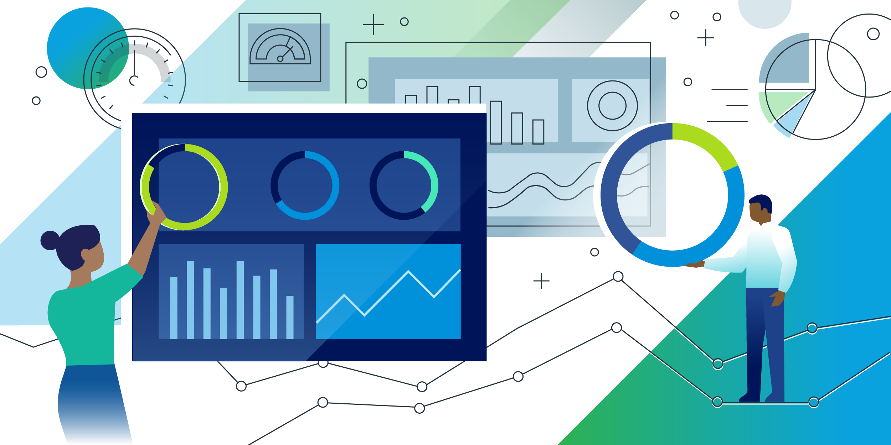

# Interactive Visualization
by [Amanda Oliveira](https://www.linkedin.com/in/amanda-guedes-de-oliveira-0776366a/)

#### **Goals for this project**

Interactive visualization is becoming a more prominent feature of reporting. Business analytics packages tend to stress the ease with which data can be played with by non-experts. Allowing students to explore aspects of complex data rather than simply telling them what you see can be a powerful tool for learning. Within the RStudio universe this functionality is accomplished through the Shiny ecosystem. A web-app designing interface that allows web-apps to be built from within R.

In this project I will build an interactive visualization using the quiz-categories.csv and midterm-results.csv datasets. These data represent midterm results from an open book test, and lists the skills required to answer each question.

 

<red>

##### [**YOU CAN ACCESS THE FINISHED SHINY APP HERE**](https://amanda-ago.shinyapps.io/app_visualization_amanda/)

 

#### **Resources**

###### **Package Documentation**

[Shiny Gallery](https://shiny.rstudio.com/gallery/)

[D’Agostino McGowan, L. (2018). Building Dashboards with shinydashboard](https://www.datacamp.com/courses/building-dashboards-with-shinydashboard)

###### **Readings**

[Shiny Apps Documentation](https://shiny.rstudio.com/)

[Verbert, K., Duval, E., Klerkx, J., Govaerts, S., & Santos, J. L. (2013). Learning Analytics Dashboard Applications. American Behavioral Scientist, 57(10), 1500–1509.](http://journals.sagepub.com/doi/abs/10.1177/0002764213479363)

[Corrin, L., & de Barba, P. (2014). Exploring students’ interpretation of feedback delivered through learning analytics dashboards. In Proceedings of the Ascilite 2014 Conference.](https://www.researchgate.net/profile/Paula_De_Barba/publication/271769111_Exploring_students'_interpretation_of_feedback_delivered_through_learning_analytics_dashboards/links/54d14ed20cf25ba0f0411598.pdf)

###### **Videos**

[Ng, J. (2018). 2 Min Intro to Shiny](https://youtu.be/HVa42mJYppE)

[CBMI WUSM. (2016). Hands on Shiny Dashboard.](https://www.youtube.com/watch?v=jUgb4l2obgU)

[Dhankar, R. (2015). HR Attrition Dashboard - Shiny and ggplot2](https://www.youtube.com/watch?v=5FnuAvljPqQ&list=PLQE-vxB8i4yh8WYqpgFsEv40W0xd8a4D2)

